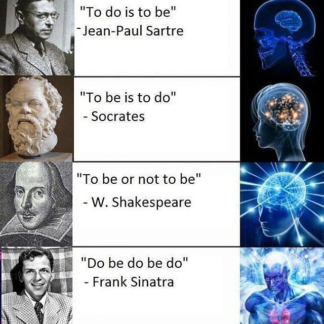

## Today

- Thus far we have:
	- Used multi-layer networks to do tasks of (potentially) arbitrary complexity.
    - Only looked at vision
    - Now, we look at  text generation.
- These used to be called "Markov chains", so I named this "Markov"
    - I don't know who "Markov" is.

# Recap

## My Lab Solution

```{python}
import numpy as np
dice = np.array([
    [0,0,0,0,1,0,0,0,0],
    [0,0,1,0,0,0,1,0,0],
    [1,0,0,0,0,0,0,0,1],
    [0,0,1,0,1,0,1,0,0],
    [1,0,0,0,1,0,0,0,1],
    [1,0,1,0,0,0,1,0,1],
    [1,0,1,0,1,0,1,0,1],
    [1,0,1,1,0,1,1,0,1]
])
compress = dice[:,:5]

top = np.array([
       [-1.0,  3.0, -1.0,  3.0,  1.0], # 1 ior 6
       [ 1.0, -2.0,  1.0, -2.0,  0.0], # 2, 3, 4, or 5
       [ 0.5, -2.0,  0.5, -2.0,  0.0], # 4 ior 5
       [ 0.0,  0.0,  0.0,  0.0,  1.0], # Odd
])
top = top.transpose()

bot = np.array([
       [ 0.5, -1.0, -1.0,  0.5], # 1
       [-1.0,  1.0, -1.0, -1.0], # 2
       [-1.0,  0.5, -1.0,  0.5], # 3
       [-1.0,  0.5,  0.5, -1.0], # 4
       [-1.0,  0.4,  0.4,  0.4], # 5
       [ 1.0, -1.0, -1.0, -1.0], # 6
])
bot = bot.transpose()

for die in compress:
    print(1 <= (1 <= die @ top) @ bot)
```

# Motivation

## Vision

- I personally have a soft spot for computer vision.
    - I think it's quality is quite high.
        - I think computer vision frameworks are better at recognizing images than humans.
        - I believe image generation (when done properly) is *completely* indistinguishable from photography, even to experts.
        
## Text

- I could not, realistically, how a lower opinion of large language models, like ChatGPT or Gemini
    - I basically don't think they can do anything "worth doing"
        - They can, for example, write emails that aren't worth sending.
    - For some reason, they have "broken out" of computer science into broader cultural relevance.
        - In a way that vision frameworks have not.
        
## Nevertheless!

- The *raison d'être* for this course is that "the powers that be" now think AI is a big deal because of LLMs.
- So, let's generate some text.

## Differences

- Like with seeing dice, we need to somehow package up words into neurons.
- Like with predicting numbers, we need to somehow back up... also words into neurons, again?
    - LLMs go from words-to-words, vision goes from images-to-words.

## Setting the stage

- ImageNet, the big vision thing, came out in 2006.
- The LLM was developed in 2017
- ChatGPT became "prominent" in 2023

## Looking at Google

- We'll do Google relative - they competed in ImageNet, developed the LLM, and have a pretty major one (Gemini).
- How big is Google?
    - In 2006, 122 billion USD market cap
    - In 2017, 729 billion USD market cap
    - In 2026, 3680 billion USD market cap
- Why does this matter?

## Scaling

- There are a lot of words.
    - And there are more words in a sentence than there are in general.
    - For example, that previous line contained "in" twice.
    - Basically, more than 9 inputs (for dice).
- The thing that held up LLMs was not having enough computing power to encode all words.

## Our example

:::: {.columns}

::: {.column width="50%"}

- We'll use an extremely restricted example, inspired by a meme I saw once.

:::

::: {.column width="50%"}



:::

::::

## Punch into Colab

- I just typed these into Colab.
    - I used all lower case and no punctuation (and change "not" to "no" for length)
    - This is a similar "simplifying assumption" as regarded dots as *only* present or absent.

```{python}
sar = "to do is to be"
soc = "to be is to do"
sha = "to be or no to be"
sin = "do be do be do"
all = [sar, soc, sha, sin]
```

## Tokenizing

- There's a core insight in *computational linguistics* called "tokenization".
- Somehow, have to break up words into things that can be recognized by a "sensory neuron".
- I treat individual words as tokens.
    - This could be an entire class.

```{python}
words = [quote.split() for quote in all]
print(words)
```

## Sets

- I want to see how many *unique* words there are.
    - Obviously, "to" appears *many* times.
- I use a "set", a mathematical object that is a (1) collection with (2) no duplicates.
    - They also aren't ordered, which doesn't really matter here.

```{python}
sets = [set(quote) for quote in words]
print(sets)
```

## Unique words

- How many words are there across all three phrases?
- I take the *union* of sets, which is all elements in at least one set.

```{python}
unique = set.union(*sets)
print(unique)
```

- Only 6 words! Not too bad!
    - Only one more than our compressed dice.

## Making a Network

- We can make something that looks an awful lot like a perceptron!

```{dot}
//| echo: false
graph SudokuBipartite {
    rankdir=TB;
    bgcolor="transparent"  
    node [shape=circle, fontcolor = "#ffffff", color = "#ffffff"]
    edge [color = "white"]
    

    // --- PARTITION 1: SRC ---
    subgraph cluster_cells {
        rankdir=LR;
        node [style=filled, fillcolor="red"];
        OR; DO; IS; NO; BE; TO;
    }

    // --- PARTITION 2: DST ---

    subgraph cluster_cells {
        rankdir=RL;
        node [fillcolor="blue"];
        OR1 [label="OR"]; DO1 [label="DO"]; IS1 [label="IS"]; 
        NO1 [label="NO"]; BE1 [label="BE"]; TO1 [label="TO"];
    }

    OR -- {OR1, DO1, IS1, NO1, BE1, TO1};
    DO -- {OR1, DO1, IS1, NO1, BE1, TO1};
    IS -- {OR1, DO1, IS1, NO1, BE1, TO1};
    NO -- {OR1, DO1, IS1, NO1, BE1, TO1};
    BE -- {OR1, DO1, IS1, NO1, BE1, TO1};
    TO -- {OR1, DO1, IS1, NO1, BE1, TO1};
    

}
```

## Edge Weights

- How do we determine edge weights?
- Or perhaps, what are we trying to do?
- Let's imagine what our task is:
    - We want to generate text given some text, so...
    - Given a word, produce the next word.
    
## Words-to-words

- So, what do we do?
    - Let's take a look at our "quotes".
    - Let's see which words follow which other words.
        - Perhaps at which probability.
    - Let's plug those in as edge weights.
    
## First things first

- Let's just look at one word - the first word we see.

```{python}
words
```

- Okay, that word is "to".

## Second things second

- What words can follow "to".
    - Well, it looks to me like "do" and "be"
    - I can write some code to make sure.
    - The point of this class isn't writing that code, but I will show it for the interested student!
    
## Finding what's next

- I loop over all quotes.
    - I loop over all words in the quotes.
        - If the current word is "to", I save the next word.
- I look at all the next words.

```{python}
next = []
for quote in words:
    for loc, word in enumerate(quote):
        if word == "to":
            next.append(quote[loc + 1])
print(next)
```

## Do this for all words

- We aren't restricted for doing this just for "to"
- Do it for all the words!
    - We have to add one special case.
    - We check quote length to make sure there is a next word.
    
```{python}
nexts = []
for first in unique:
    next = []
    for quote in words:
        for loc, word in enumerate(quote):
            if word == first and loc + 1 < len(quote):
                next.append(quote[loc + 1])
    nexts.append(next)
```

## Let's see it

```{python}
print(nexts)
```

- Oh... that is tough to understand.
    - We'll use another coding thing that I should mention.
    - I think it will be important to AI in the future, not seeing much usage now.
    
# Key-Value Storage

## A dictionary

- What we really need is something a lot like a dictionary.
    - Rather just have a list of lists of words, we want a list of words for each starting word.
    - Dictionaries also contain "lists of words" (definitions) for each word.
- In computing, we term this "key-value storage".
    - Keys are words
    - Values are definitions.
    
## Colab has dictionaries

- There so happens to be something called a dictionary (well, a `dict`) I can use.

```{python}
d = dict()
print(d)
```

## Adding keys

- We add things to dictionary as *key-value pairs*
    - We take the name of the dictionary, like `my_values`
    - We add box brackets `[]`
    - Within those brackets, we give the key (e.g. the word for which we are storing the definition
    - We use single-equals assignment to set the value of the key within the dictionary.
- Like this:

```{python}
d["to"] = ['do', 'be', 'be', 'do', 'be', 'be']
```

## Seeing values

- It is easy enough to see a value from here.
- Same as setting a value, just without single-equals assignment.
    - We take the name of the dictionary, like `my_values`
    - We add box brackets `[]`
    - Within those brackets, we give the key (e.g. the word for which we are storing the definition

```{python}
print(d["to"])
```

# Back To Work

## Use A `dict`

- Same as before, but we use a dictionary.
    - The key is "before" or "first" word.
    - The value is the "next" or "second" word.

```{python}
nexts = dict()
for first in unique:
    next = []
    for quote in words:
        for loc, word in enumerate(quote):
            if word == first and loc + 1 < len(quote):
                next.append(quote[loc + 1])
    nexts[first] = next
```

## Easier to see

- Recall - we are doing this to find *edge weights*

```{python}
print(nexts)
```

- A bit easier visually with some formatting.

```{python}
for first in nexts:
    print(first, nexts[first])
```

## Takeaways

```{python}
for first in nexts:
    print(first, nexts[first])
```

- "no" only precedes "to".
- "or" only precedes "no"
- "is" only precedes "to"
- Others are more complex.

## Early sketch

:::: {.columns}

::: {.column width="50%"}

- "no" only precedes "to".
- "or" only precedes "no"
- "is" only precedes "to"


:::

::: {.column width="50%"}

```{dot}
//| echo: false
//| fig-width: 400px
graph SudokuBipartite {
    rankdir=TB;
    bgcolor="transparent"  
    node [shape=circle, fontcolor = "#ffffff", color = "#ffffff"]
    edge [color = "white"]
    

    // --- PARTITION 1: SRC ---
    subgraph cluster_cells {
        rankdir=LR;
        node [style=filled, fillcolor="red"];
        OR;  IS; NO;
    }

    // --- PARTITION 2: DST ---

    subgraph cluster_cells {
        rankdir=RL;
        node [fillcolor="blue"];
        NO1 [label="NO"];  TO1 [label="TO"];
    }

    OR -- {NO1};
    IS -- {TO1};
    NO -- {TO1};
}
```

:::

::::

## Meaning of weights

- We have a problem now.
- Historically, we have used *determinism*
    - Every single time we see a six-sided die, we say it represents a six.
- Now we must use *non-determinism*
    - Sometimes when we see a "to", it is followed by "be"
    - Sometimes it is followed by "do".
    - How do we handle this?
    
## Calculate Weights

- Let's take an edge weight to be the *probability*.
- "to" will have an edge of weight $\frac{2}{3}$ going to "be".


```{dot}
//| echo: false
graph SudokuBipartite {
    rankdir=TB;
    bgcolor="transparent"  
    node [shape=circle, fontcolor = "#ffffff", color = "#ffffff"]
    edge [color = "white"]
    
    // --- PARTITION 1: SRC ---
    subgraph cluster_cells {
        rankdir=LR;
        node [style=filled, fillcolor="red"];
        OR; DO; IS; NO; BE; TO;
    }

    // --- PARTITION 2: DST ---

    subgraph cluster_cells {
        rankdir=RL;
        node [fillcolor="blue"];
        OR1 [label="OR"]; DO1 [label="DO"]; IS1 [label="IS"]; 
        NO1 [label="NO"]; BE1 [label="BE"]; TO1 [label="TO"];
    }

    NO -- {TO1} [penwidth=3.0] ;
    BE -- {IS1, OR1} [penwidth=.75] ;
    BE -- {DO1} [penwidth=1.5] ;
    DO -- {IS1} [penwidth=1] ;
    DO -- {BE1} [penwidth=2] ;
    TO -- {DO1} [penwidth=1] ;
    TO -- {BE1} [penwidth=2] ;
    IS -- {TO1};
    OR -- {NO1};
    
}
```

## Let's look at "be"

:::: {.columns}

::: {.column width="50%"}

- The way I think of this is:
    - After a "be", at 25% probability see an "is"
    - After a "be", at 25% probability see an "or"
    - After a "be", at 50% probability see an "do"
    
:::

::: {.column width="50%"}

```{dot}
//| echo: false
//| fig-width: 400px
graph SudokuBipartite {
    rankdir=TB;
    bgcolor="transparent"  
    node [shape=circle, fontcolor = "#ffffff", color = "#ffffff"]
    edge [color = "white"]
    
    // --- PARTITION 1: SRC ---
    subgraph cluster_cells {
        rankdir=LR;
        node [style=filled, fillcolor="red"];
        BE;
    }

    // --- PARTITION 2: DST ---

    subgraph cluster_cells {
        rankdir=RL;
        node [fillcolor="blue"];
        OR1 [label="OR"]; IS1 [label="IS"]; DO1 [label="DO"]; 
    }

    BE -- {IS1, OR1} [penwidth=.75] ;
    BE -- {DO1} [penwidth=1.5] ;
    
}
```

:::

::::

## Generating Text

- So, if we want to generate text.
    - We look at the current word.
    - We flip a coin or roll a die.
- For "be" we use a four-sided die.
    - And two numbers correspond to "do".


## Rolling Die in Colab

- We have already seen random numbers, when setting up our perceptron.
- It is easy enough to.
    - Generate a random number between zero and one.
    - Multiply it by the number of "next words"
    - Round or truncate to a whole number
    - Look up the number in that position, which is now the next number.
    
## In Colab

- Here's the code - don't worry about understanding it unless you want.
    - `nexts` is the dictionary we made earlier.

```{python}
def next_word(prev_word):
    die = np.random.rand()
    possible_words = nexts[prev_word]
    position = die * len(possible_words)
    position = int(position)
    return possible_words[position]
```

## Try it out

- We'll ask for the next word several times and hope to get different answers.

```{python}
next_word("be")
```
```{python}
next_word("be")
```
```{python}
next_word("be")
```
```{python}
next_word("be")
```
```{python}
next_word("be")
```

## Generating text

- We can now use a neural network to generate text!
- We just provide a starting word.
    - We will also provide a length, though there's ways around that!
    
```{python}
word = "to"
print(word)
for _ in range(4):
    word = next_word(word)
    print(word)
```

## Clean it up

- Rather than printing each word, we'll add words together into one big thing to print.
- We'll also put all the code in a function.
- We'll allow the function to accept a starting word and a length.

```{python}
def make_text(first_word, num_words):
    text = first_word
    word = first_word
    for _ in range(num_words - 1):
        word = next_word(word)
        text = text + " " + word
    print(text)
```

## Some examples

```{python}
make_text("to", 5)
```
```{python}
make_text("to", 5)
```
```{python}
make_text("to", 5)
```
```{python}
make_text("to", 5)
```
```{python}
make_text("to", 5)
```
```{python}
make_text("to", 5)
```
```{python}
make_text("to", 5)
```


## More examples

- Longer.

```{python}
make_text("to", 10)
```
```{python}
make_text("to", 10)
```

- Start with other words.

```{python}
make_text("be", 5)
```
```{python}
make_text("no", 5)
```
```{python}
make_text("is", 5)
```

# Bonuses

## If Time

- We can look at start and stop tokens.
- We can discuss attention.

# Summary

## What we learned

- You can generate text with neural networks.
- We used a single layer, but of course...
    - It seems an awful lot like you can do *anything* by stacking them.

# Fin